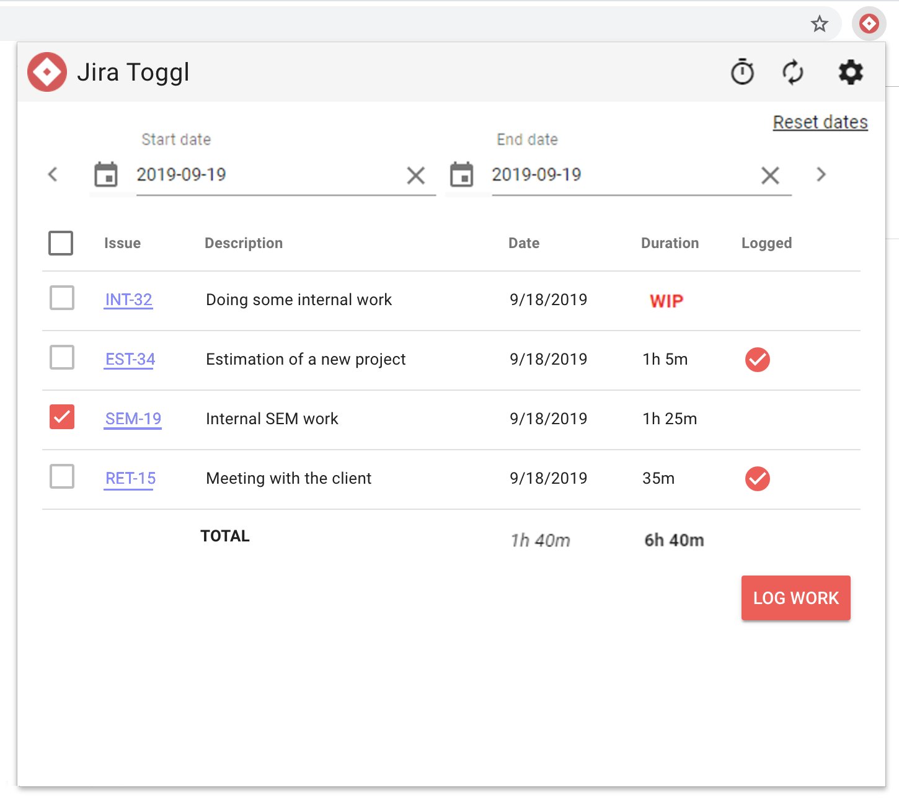
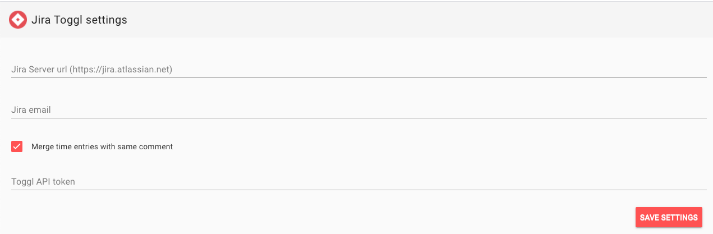

# Jira Toggl

A web extension for syncing Toggl timelog entries to your Jira Software worklog.

## How it looks

### Popup

### Settings

## Download
Link to Chrome store: https://tinyurl.com/y4pj9por

## Contributing To This Project

Anyone and everyone is welcome to contribute. Just create a PR with your changes and I will have a look at it.

## Building the extension
Barrowed from the [vue-web-extension](https://github.com/Kocal/vue-web-extension/edit/master/README.md) that this project is based on

### `npm run build`

Build the extension into `dist` folder for **production**.

### `npm run build:dev`

Build the extension into `dist` folder for **development**.

### `npm run watch`

Watch for modifications then run `npm run build`.

### `npm run watch:dev`

Watch for modifications then run `npm run build:dev`.

It also enable [Hot Module Reloading](https://webpack.js.org/concepts/hot-module-replacement), thanks to [webpack-chrome-extension-reloader](https://github.com/rubenspgcavalcante/webpack-chrome-extension-reloader) plugin.

:warning: Keep in mind that HMR only works for your **background** entry.

### `npm run build-zip`

Build a zip file following this format `<name>-v<version>.zip`, by reading `name` and `version` from `manifest.json` file.
Zip file is located in `dist-zip` folder.

## License

Copyright &copy; 2019 Simon Eldevig

Licensed under the [MIT License](LICENSE)
